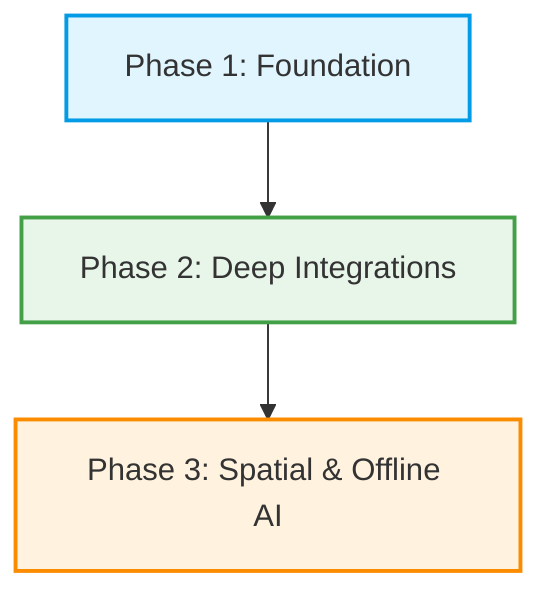

# 🌍 SafarAI — AI-Powered Travel Planning Platform

[](https://choosealicense.com/no-license/)
[](https://react.dev/)
[](https://vitejs.dev/)
[](https://tailwindcss.com/)
[](https://supabase.com/)

> **SafarAI** is an advanced, AI-driven travel planning ecosystem that consolidates smart itineraries, transit navigation, safety intelligence, and budget optimizations into a unified, user-centric interface.

SafarAI is a premium product of **TravelCore Technologies**, operating alongside sister platform **Railverse** to build the future of unified mobility and exploration.

---

## 🗺️ Project Architecture & Structure

This repository is split into two primary components:

1.  **Vite + React SPA (Root)**: The high-performance client dashboard, safety portal, and AI chat client.
2.  **Next.js Web Application (`/safarai-app`)**: The server-rendered portal optimized for community sharing, dynamic SEO landing pages, and metadata generation.

```
SafarAI-App/
├── src/                    # React SPA Frontend Source
│   ├── components/         # Shared UI Components (Buttons, Cards, Modals)
│   ├── pages/              # Routing Components (HomePage, SafetyPage, etc.)
│   ├── services/           # External API Clients (Supabase, Groq SDK)
│   ├── layouts/            # Page structures (MainLayout, Sidebar)
│   └── styles.css          # Global styles & Tailwind configuration
├── safarai-app/            # Next.js Server-Side Sub-Application
│   ├── app/                # Next.js App Router (Pages & Layouts)
│   └── public/             # Next.js static assets
├── public/                 # SPA static assets
├── vite.config.js          # Vite Bundler configuration
└── package.json            # NPM Dependencies & Scripts
```

---

## ⚡ Core Pillars & Capabilities

### 🤖 1. Context-Aware AI Travel Assistant

Leverages the **openai/gpt-oss-120b** model via the **Groq SDK** to run low-latency, context-sensitive reasoning engines. It plans complete multi-day itineraries, explains cultural taboos, translates key phrases, and dynamically suggests local spots.

### 🛡️ 2. Safety intelligence Core

An interactive toolkit featuring:

- **Geo-Safety Scores**: Aggregates community feedback and local advisories.
- **Emergency Toolkit**: Instant access to local emergency contacts, embassy locations, and offline-compatible SOS protocols.
- **Safe Path Finder**: Dynamic route adjustments to prioritize well-lit, populated, and highly rated transit paths.

### 🚆 3. Transit & Rail Integration (Powered by Railverse)

Deep coordination with **Railverse** allows travelers to:

- Correlate flight schedules, bus routes, and train services.
- Query real-time seat availability, live platform coordinates, and delay metrics.

### 💰 4. Predictive Budget & Expense Calculator

- **Cost Projection**: Learns from community-pooled travel data to forecast destination costs.
- **Smart Categorization**: Track food, transit, logging, and activities with automatic currency conversion.

---

## 🔮 SafarAI Future Roadmap (Upgrades & Vision)

We are actively designing the next phase of SafarAI. Our roadmap includes key milestones:



### 🛰️ Phase 1: Real-time Sync & Collaborative Lobbies

- **Dynamic Group Planning**: Shareable planner lobbies with real-time editing, group voting on locations, and automated expense-splitting calculators.
- **Cross-Platform Sync**: Push notifications alerting users to check-in times, delay updates, and safety alerts directly on their mobile devices.

### 🔗 Phase 2: Native Railverse Booking Engine

- **One-Click Checkout**: Purchase train, flight, and local transit tickets in a single transaction window.
- **Live PNR Tracking**: Push notifications detailing platform updates, train delays, and delay compensation filings.

### 🌐 Phase 3: Spatial Navigation & Offline-First AI

- **On-Device AI Engines**: Download compressed LLMs (like Gemma 2B or Llama 8B) to run entirely offline, ensuring navigation and AI support function without cellular reception.
- **AR Destination Overlays**: Point the mobile camera to overlay historical insights, restaurant ratings, and active safety directions onto the physical world.

---

## 🚀 Local Installation & Execution

### 1. Root React Client (SPA)

Ensure you have Node.js (v18+) installed.

```bash
# Clone the repository
git clone https://github.com/vishalsingh7126/SafarAI-App.git
cd SafarAI-App

# Install package dependencies
npm install

# Set up your environment variables
cp .env.example .env # or configure the .env template manually

# Spin up the local development server
npm run dev
```

Open [http://localhost:5173](http://localhost:5173) in your browser.

### 2. Next.js Community Web Portal

```bash
cd safarai-app
npm install
npm run dev
```

Open [http://localhost:3000](http://localhost:3000) in your browser.

---

## 👥 Contributor Guidelines & Git Protocols

As a private code repo under **TravelCore Technologies**, security and clean history are paramount. Please conform to these guidelines:

1.  **Branch Naming Rules**:
    - Features: `feature/name-of-feature`
    - Fixes: `fix/name-of-fix`
    - Optimizations: `perf/name-of-perf`
2.  **Pull Requests**:
    - Target the `main` branch.
    - Explain what changed and link any related design issues.
    - A minimum of **1 peer review** is required before merging.
3.  **Secrets & Security**:
    - Never commit API keys or credentials.
    - Ensure all secrets are stored inside your local `.env` which is ignored by Git.

---

## 🏢 Corporate & Founder Information

**SafarAI** is a registered product of **TravelCore Technologies Pvt. Ltd.**

- **Founder**: Vishal Singh
- **Sister Platforms**: Railverse
- **Support**: developer@travelcore.com

---

<p align="center">
  <b>SafarAI • A TravelCore Product</b><br>
  © 2026 TravelCore Technologies Pvt. Ltd. All rights reserved.
</p>
