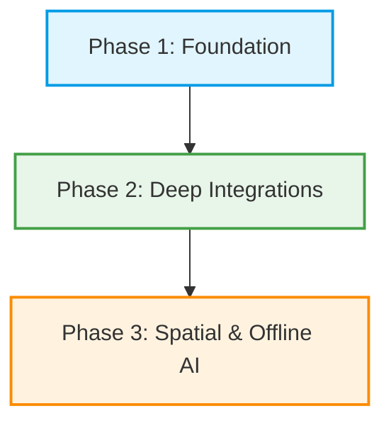

# 🌍 SafarAI — AI-Powered Travel Planning Platform

[](https://choosealicense.com/no-license/)
[](https://react.dev/)
[](https://vitejs.dev/)
[](https://tailwindcss.com/)
[](https://supabase.com/)

> **SafarAI** is an advanced, AI-driven travel planning ecosystem that consolidates smart itineraries, transit navigation, safety intelligence, and budget optimizations into a unified, user-centric interface.

SafarAI is a premium product of **TravelCore Technologies**, operating alongside sister platform **Railverse** to build the future of unified mobility and exploration.

---

## 🗺️ Project Architecture & Structure

This repository is split into two primary components:
1.  **Vite + React SPA (Root)**: The high-performance client dashboard, safety portal, and AI chat client.
2.  **Next.js Web Application (`/safarai-app`)**: The server-rendered portal optimized for community sharing, dynamic SEO landing pages, and metadata generation.

```
SafarAI-App/
├── src/
│   ├── components/
│   │   ├── ui/             # Design-system primitives (Button, Card, Modal, Tabs…)
│   │   ├── home/           # Landing-page sections (Hero, Globe, Map, Features)
│   │   ├── charts/         # Dependency-free SVG charts (donut, bars, sparkline)
│   │   └── *.jsx           # Shell components (Navbar, Footer, CommandPalette…)
│   ├── context/            # Theme, Toast, Auth, Workspace and Assistant providers
│   ├── hooks/              # Reveal, count-up, tilt, debounce, storage, media query
│   ├── lib/                # cn(), formatters, itinerary engine
│   ├── config/             # Navigation model shared by nav, footer and search
│   ├── data/               # Destination, hotel, food, budget and transport datasets
│   ├── pages/              # Route components
│   ├── services/           # External clients (Supabase, Groq)
│   ├── layouts/            # MainLayout (shell, shortcuts, assistant dock)
│   └── styles.css          # Design tokens, base layer, utilities, motion
├── scripts/                # jsdom render + user-flow test harnesses
├── safarai-app/            # Next.js Server-Side Sub-Application
├── public/                 # SPA static assets
├── vite.config.js          # Bundler config (code splitting, dev host)
└── tailwind.config.js      # Theme mapping for the design tokens
```

---

## ⚡ Core Pillars & Capabilities

### 🤖 1. Context-Aware AI Travel Assistant
Leverages the **Llama 3.3 70B** model via the **Groq SDK** to run low-latency, context-sensitive reasoning engines. It plans complete multi-day itineraries, explains cultural taboos, translates key phrases, and dynamically suggests local spots.

### 🛡️ 2. Safety intelligence Core
An interactive toolkit featuring:
*   **Geo-Safety Scores**: Aggregates community feedback and local advisories.
*   **Emergency Toolkit**: Instant access to local emergency contacts, embassy locations, and offline-compatible SOS protocols.
*   **Safe Path Finder**: Dynamic route adjustments to prioritize well-lit, populated, and highly rated transit paths.

### 🚆 3. Transit & Rail Integration (Powered by Railverse)
Deep coordination with **Railverse** allows travelers to:
*   Correlate flight schedules, bus routes, and train services.
*   Query real-time seat availability, live platform coordinates, and delay metrics.

### 💰 4. Predictive Budget & Expense Calculator
*   **Cost Projection**: Learns from community-pooled travel data to forecast destination costs.
*   **Smart Categorization**: Track food, transit, logging, and activities with automatic currency conversion.

---

## 🔮 SafarAI Future Roadmap (Upgrades & Vision)

We are actively designing the next phase of SafarAI. Our roadmap includes key milestones:



### 🛰️ Phase 1: Real-time Sync & Collaborative Lobbies
*   **Dynamic Group Planning**: Shareable planner lobbies with real-time editing, group voting on locations, and automated expense-splitting calculators.
*   **Cross-Platform Sync**: Push notifications alerting users to check-in times, delay updates, and safety alerts directly on their mobile devices.

### 🔗 Phase 2: Native Railverse Booking Engine
*   **One-Click Checkout**: Purchase train, flight, and local transit tickets in a single transaction window.
*   **Live PNR Tracking**: Push notifications detailing platform updates, train delays, and delay compensation filings.

### 🌐 Phase 3: Spatial Navigation & Offline-First AI
*   **On-Device AI Engines**: Download compressed LLMs (like Gemma 2B or Llama 8B) to run entirely offline, ensuring navigation and AI support function without cellular reception.
*   **AR Destination Overlays**: Point the mobile camera to overlay historical insights, restaurant ratings, and active safety directions onto the physical world.

---

## 🎨 Design System (v2)

SafarAI runs on one token-driven design system — every page is composed from the
same primitives, so nothing looks bolted on.

| Layer | Definition |
| --- | --- |
| **Primary** | Indigo `#4f46e5 → #6366f1` (actions, active states, brand gradient) |
| **Accent** | Cyan `#06b6d4` (AI surfaces, secondary emphasis) |
| **Highlight** | Amber `#f59e0b` (ratings, pricing attention) |
| **Semantics** | Emerald = success, Rose = danger, Violet = premium tiers |
| **Surfaces** | `canvas / surface / surface-muted / surface-raised` as CSS variables |
| **Text** | `fg / fg-muted / fg-subtle` — a strict three-step hierarchy |
| **Radius** | 8 → 12 → 16 → 24 → 32 px scale, pills for actions |
| **Shadows** | `xs · sm · card · lift · glow` (elevation communicates interactivity) |
| **Type** | Sora for display, Plus Jakarta Sans for UI, fluid `clamp()` scale |
| **Motion** | 140/220/420 ms with `cubic-bezier(.22,1,.36,1)`; all motion respects `prefers-reduced-motion` |

**Dark mode is first-class.** Themes flip a single set of CSS variables (`:root` vs
`.dark`), the choice persists in `localStorage`, and an inline script applies it
before first paint so there is no flash.

### UI primitives (`src/components/ui`)
`Button · Card · Input/Select/Textarea/Switch/Checkbox/RangeSlider · Field · Badge ·
Chip · Tabs · Modal · Tooltip · Progress · Steps · Skeleton · EmptyState · StatCard ·
Rating · Avatar · Icon (60+ inline stroke icons, zero icon dependencies)`

---

## ✨ Experience Highlights

*   **Cinematic landing page** — parallax gradient field, rotating value proposition,
    instant destination search with suggestions, and a photoreal 3D Earth in the
    hero (drag to spin, click a marker to open the destination).
*   **World Explorer (`/world`)** — the 3D globe and a real terrain/satellite map
    side by side, with continent, travel-type, budget, season and safety filters
    across 152 destinations.
*   **Command palette (`⌘K` / `Ctrl+K` / `/`)** — one search across destinations,
    stays, food spots, saved trips and every page, with recent searches and an
    "Ask the AI" fallback for natural-language questions.
*   **Real cartographic map on the landing page** — satellite/terrain basemaps,
    clustering and marker previews, loaded only when it scrolls into view.
*   **Personal workspace** — favourites, recently viewed, activity feed, saved trips
    and preferences persist locally and personalise recommendations plus AI answers.
*   **Trip Planner** — autocomplete, date presets, visual style picker, live budget
    estimate, animated timeline, save / copy / download / "refine with AI".
*   **Planning workspace (`/plan-trip`)** — turns a saved itinerary into a booking,
    prep and packing checklist with a countdown and per-trip progress.
*   **Dashboard (`/profile`)** — KPI cards with animated counters, activity charts,
    travel-style donut, timeline, saved-items library and preference controls.
*   **Safety intelligence** — destination risk scoring, offline emergency toolkit,
    pre-trip checklist and scenario playbooks with a one-tap location share.
*   **Transport hub** — cost / time / comfort / CO₂ comparison across rail, air, bus
    and road, weighted by what the traveller optimises for.
*   **Community** — traveller stories with likes, filters, a validated composer and
    reading view.
*   **Polished states everywhere** — skeleton loaders, empty states with next-best
    actions, inline validation, toasts and retryable errors.

### Accessibility & performance
*   Semantic landmarks, skip link, focus-visible rings, ARIA only where needed,
    keyboard support for tabs, menus, palette and modals (focus trap + restore).
*   Route-level code splitting, deferred Supabase and Groq SDKs, lazy assistant
    (markdown renderer loads on demand), lazy images, throttled canvas rendering.
*   First-load JS is ~98 kB gzipped; heavy features stream in only when used.

### AI behaviour
The Groq (Llama 3.3 70B) integration is unchanged, but the assistant now shares one
conversation across the dock and the full-page view, receives traveller context
(home city, style, saved trips, recent views), and **degrades gracefully**: with no
API key it answers from the in-app destination, hotel and food datasets instead of
failing.

---

## 🌍 Realistic Globe, Map & the Global Catalogue

### Photoreal 3D globe (`src/components/geo/RealisticGlobe.jsx`)
Built directly on three.js — no globe wrapper library — so every layer is
tuned for this product.

| Layer | Detail |
| --- | --- |
| **Surface** | NASA Blue Marble colour imagery (2K), progressively upgraded from a 240 kB preview |
| **Night** | NASA city-lights map blended across the terminator, with faint earthshine on oceans |
| **Relief** | Topography map read as a height field; normals perturbed by finite differences for real mountain shading |
| **Oceans** | Land/water mask drives a Blinn-Phong sun glint that only appears on water |
| **Lighting** | Sun direction from the true sub-solar point (NOAA solar position), refreshed every minute — the lit face matches actual world time |
| **Atmosphere** | Additive fresnel shell that brightens toward the sun, plus warm scattering along the terminator and limb darkening |
| **Clouds** | Procedural fBm layer with tropical/mid-latitude banding, drifting slowly (toggleable) |
| **Sky** | Parallaxed star field |
| **Markers** | GPU point cloud coloured by continent, back-face culled, with HTML labels that thin out by zoom level |

Interaction: drag to orbit, scroll/pinch to zoom, click a marker to select, and
an eased `flyTo(lat, lng)` that slerps the camera along a great circle.

### Real map (`src/components/geo/WorldMap.jsx`)
Leaflet with four keyless basemaps — **Esri World Imagery** (satellite +
boundary/place labels), **OpenTopoMap** (contours and relief), **CARTO Voyager**
(streets) and **CARTO Dark** — plus:

* pixel-grid clustering that splits as you zoom (global → continent → country → city → place)
* branded pins, permanent labels past zoom 5, popups with the destination brief
* great-circle **route visualisation** from your home city with live distance
* scale bar, fit-to-results, keyboard-reachable markers, provider attribution

### Globe → map hand-off
Selecting a destination flies the globe in, then swaps to the map already
centred on the same coordinate at street-level zoom, so the two views read as
one continuous camera move.

### Global destination catalogue (`src/data/world/`)
**152 destinations · 75 countries · 9 continents**, all with real WGS84
coordinates and factual travel data (best season, daily cost in ₹, safety
score, ideal duration, attractions, activities, UNESCO status, tags).

```
src/data/world/
├── _shared.js              # make() factory, season presets, derived fields
├── india.js                # 12 curated Indian destinations
├── asia.js                 # 32
├── europe.js               # 33
├── africa-middleeast.js    # 24
└── americas-oceania.js     # 40   (N. America, Central America, Caribbean, S. America, Oceania)
```

Photography resolves at runtime from the **Wikipedia REST API** (CORS-friendly,
cached in `sessionStorage`, gradient fallback), so adding a destination is one
`make({...})` call with no image plumbing.

Verified in `npm test`: Delhi→New York measures 11,756 km against a real 11,760;
the sub-solar point lands on the Tropic of Cancer at the June solstice; all 152
rows carry valid coordinates.

### Performance
* three.js, Leaflet and the destination catalogue are all **lazy chunks** — the landing page stays at ~98 kB gzipped critical JS.
* The hero promotes from the lightweight canvas globe to the photoreal one only when the browser goes idle, and never on low-power devices.
* Quality tiers (`low`/`medium`/`high`) scale geometry density, device pixel ratio, antialiasing, clouds, star count and which textures are fetched, using `pointer`, viewport, `deviceMemory`, `saveData` and connection hints.
* Rendering pauses when the canvas leaves the viewport; the map only mounts when its section scrolls into view.

---

## 🔧 Debugging Pass & Real-World Data Guarantee

### How the app is verified
A headless Chromium (real WebGL) drives the running app in `scripts/audit.mjs`:

```bash
# needs a Chromium binary: set CHROMIUM_PATH, or `npm i -D @sparticuz/chromium`
npm run audit        # 51 checks + screenshots to .audit/
```

It sweeps all 23 routes for console errors, page errors and failed requests,
then proves the globe paints (PNG luma/colour analysis of the composited
frame), that drag rotates it and the wheel zooms it, that markers, the detail
panel and the globe → map hand-off work, that Leaflet mounts with markers and
attribution, that POI markers appear past zoom 7, that the hotel list contains
real properties and no invented ones, and that neither the landing page nor
`/world` overflow on a 390 px viewport.

### Bugs this pass found and fixed
| Bug | Cause | Fix |
| --- | --- | --- |
| **Globe blank on mobile, page 33,554,432 px wide** | `renderer.setSize(w, h, false)` left the canvas without CSS dimensions, so it laid out at buffer size (width × DPR) → overflow → ResizeObserver saw a wider box → grew again, a runaway loop | measure the parent only, always update CSS size, and ignore no-op resizes |
| **Globe cropped by its frame** | 38° FOV at a fixed 3.1 units, plus a y-offset | FOV 42° with the distance derived from the viewport aspect, camera centred |
| **Earth looked brown** | ACES filmic tone mapping crushing the NASA imagery | neutral output, gentler twilight scattering, softer atmosphere shell |
| **Terminator moved with the camera** | lighting used a view-space normal against a world-space sun | world-space normals in both globe and atmosphere shaders |
| **Labels overlapped in clumps** | no collision handling | greedy screen-space placement with a zoom-scaled budget |
| **Nav buttons wrapped to 3 lines** | flexible buttons with wrapping labels | `whitespace-nowrap` + `shrink-0` on the button primitive, responsive nav density |
| **Hotels 200–740 km from their city** | Ashford Castle filed under Dublin, Hotel del Coronado under San Francisco | replaced with genuine Dublin and San Francisco properties; a test now enforces the radius |

### Real places only
* **Hotels were rebuilt from scratch.** Everything invented ("Sea Breeze
  Resort", "Capital Comforts Hotel", "Marine Drive Grand" …) is gone. The
  index is now 52 real properties — the Taj Mahal Palace, Rambagh Palace, Taj
  Lake Palace, The Imperial, Marina Bay Sands, Raffles, Burj Al Arab, Ritz
  Paris, The Savoy, Fairmont Banff Springs, Copacabana Palace, La Mamounia,
  Mena House, Peninsula Hong Kong … alongside real hostels and midscale stays
  (Zostel, Lub d, Generator, Pod 51, Rove, Bloomrooms) so the budget filter is
  honest. Each carries its real street address, coordinates and opening year.
* **159 points of interest** across 30 destinations — landmarks, museums,
  religious sites, markets, parks, beaches, viewpoints and airports — each with
  the site's own coordinates and Wikipedia article, rendered as category-coded
  markers past zoom 7.
* **Nothing is invented to fill a card.** Where a photo cannot be verified the
  UI says *"Photo not verified"* rather than showing an unrelated image.

### Image pipeline
```bash
npm run images:fetch          # verify + cache locally
npm run images:fetch -- --dry # verify only
```
For every place with a `wiki` reference the script resolves the article,
**cross-checks the article's coordinates against ours** (3 km for hotels, 25 km
for attractions, 120 km for destinations — this is what prevents a wrong-place
photo), downloads the lead image into `public/images/{destinations,hotels,attractions}/`
and records source, author and licence in `src/data/imageManifest.js`. Failures
are reported and left as labelled placeholders.

At runtime the resolution order is: verified local copy → curated URL → the
Wikipedia article for that exact place → labelled placeholder.

### Data integrity is a test, not a promise
`npm test` asserts: no placeholder-style names anywhere; every hotel within
200 km of its destination (250 km when explicitly flagged as a neighbouring
town); valid, unique hotel coordinates and ids; all 159 attractions within
250 km of their destination and using a known category; every Wikipedia
reference a plain article title.

---

## 🧪 Testing

A dependency-light jsdom harness renders every page inside the real providers and
drives the critical flows (generate → save itinerary, budget calculation, hotel
filtering, destination search).

```bash
npm test    # 1) renders every page/component inside the real providers
            # 2) drives 35 assertions across the critical user flows, the
            #    geographic maths and real-world data integrity
            # 3) runs axe-core on 20 surfaces (0 violations)

npm run audit   # 51 browser checks in headless Chromium + screenshots
```

Harnesses live in `scripts/` (`smoke.jsx`, `flows.jsx`, `a11y.jsx`) and are
bundled by `vite.smoke.config.js`; they need no browser.

---

## 🚀 Local Installation & Execution

### 1. Root React Client (SPA)
Ensure you have Node.js (v18+) installed.

```bash
# Clone the repository
git clone https://github.com/vishalsingh7126/SafarAI-App.git
cd SafarAI-App

# Install package dependencies
npm install

# Set up your environment variables
cp .env.example .env # or configure the .env template manually

# Spin up the local development server
npm run dev
```
Open [http://localhost:5173](http://localhost:5173) in your browser.

### 2. Next.js Community Web Portal
```bash
cd safarai-app
npm install
npm run dev
```
Open [http://localhost:3000](http://localhost:3000) in your browser.

---

## 👥 Contributor Guidelines & Git Protocols

As a private code repo under **TravelCore Technologies**, security and clean history are paramount. Please conform to these guidelines:

1.  **Branch Naming Rules**:
    *   Features: `feature/name-of-feature`
    *   Fixes: `fix/name-of-fix`
    *   Optimizations: `perf/name-of-perf`
2.  **Pull Requests**:
    *   Target the `main` branch.
    *   Explain what changed and link any related design issues.
    *   A minimum of **1 peer review** is required before merging.
3.  **Secrets & Security**:
    *   Never commit API keys or credentials.
    *   Ensure all secrets are stored inside your local `.env` which is ignored by Git.

---

## 🏢 Corporate & Founder Information

**SafarAI** is a registered product of **TravelCore Technologies Pvt. Ltd.**  
*   **Founder**: Vishal Singh  
*   **Sister Platforms**: Railverse  
*   **Support**: developer@travelcore.com  

---

<p align="center">
  <b>SafarAI • A TravelCore Product</b><br>
  © 2026 TravelCore Technologies Pvt. Ltd. All rights reserved.
</p>
